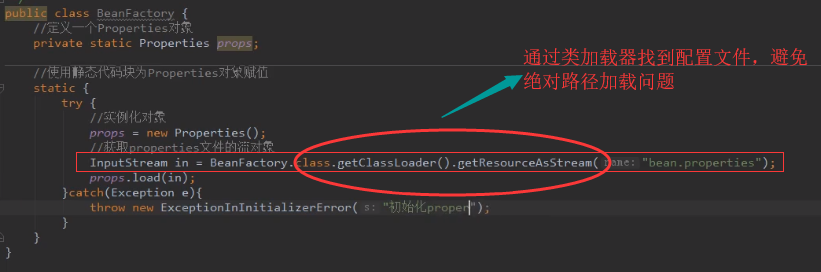

# 耦合：

## 含义：

程序之间的依赖关系

## 分类：

1、类之间的依赖

2、方法之间的依赖

# 解耦：

## 含义：

降低程序之间的依赖关系

## 实际开发做到：

编译期不依赖，运行时才依赖

## 思路：

第一步：使用反射创建对象，避免使用new关键字

~~~java
Class.forName(beanPath).newInstance();
~~~

第二步：通过读取配置文件来获取要创建的对象全限定类名

## 注意事项：

加载配置文件（Resources文件夹下通过类加载器去找）

